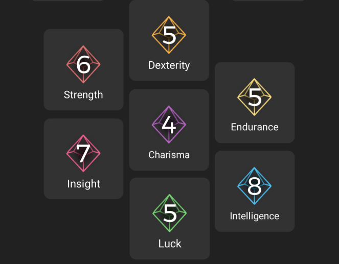
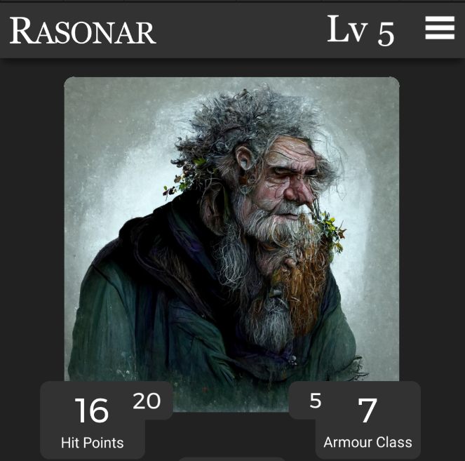
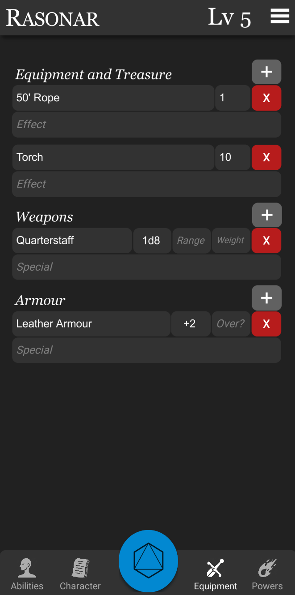
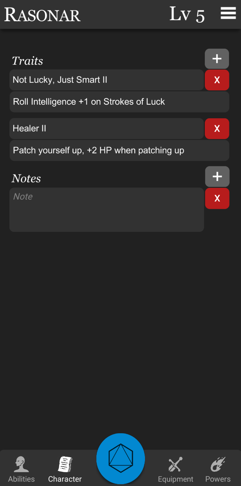
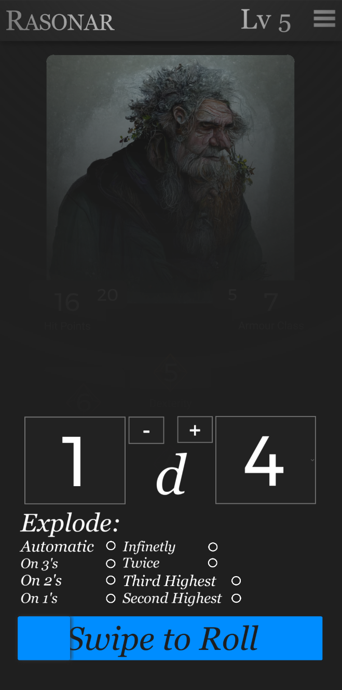
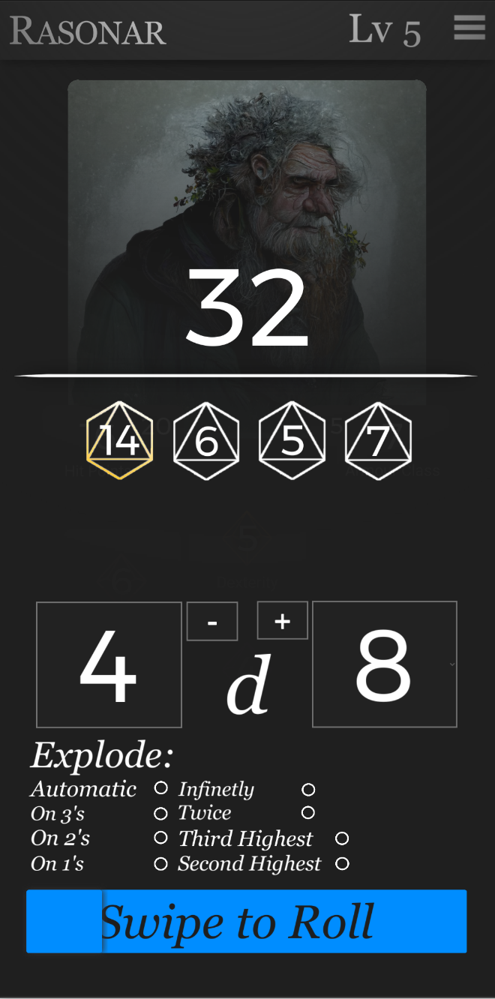
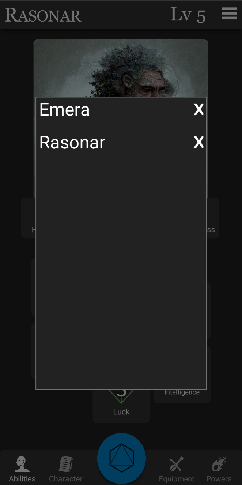

# rogue character sheet
 A character sheet mobile app for the Rogue tabletop RPG

## Features

### <u>Ability Score Tracking</u>

Track character ability scores by long-pressing on a given stat and entering a number between 1-10.

### <u>Character Names and Portraits</u>

Freely update character names and portraits using the Android / iOS native image / gallery search.

### <u>Equipment, Spells, Mutations, and Notes tracking</u>

Create and enter details for any amount of equipment, armour, weapons, spells, mutation, notes, and traits that you may need for your character.  All of which can be accessed from the nav bar at the bottom of the app.

 

### <u>Dice Roller</u>

Roll dice using the button in the middle of the nav bar.  You can also short-press on an ability score to automatically populate the dice roller with the dice for it's value, for instance tapping on an ability with a score of 5 would auto-populate the dice roller with 1d10 regardless of what it had before.

You can also increase or decrease a value of the a die by tapping the "+" or "-" buttons in the dice roller to easily give bonuses or hindrances.

The dice roller will handle exploding dice for you and has a wide array of optional parameters for certain traits or other instances where you might want to explode on different values or more frequently than the default rules allow.

 

### <u>Save And Load Multiple Characters</u>

The app autosaves your characters when you make changes and will create a new character each time you change the name.

